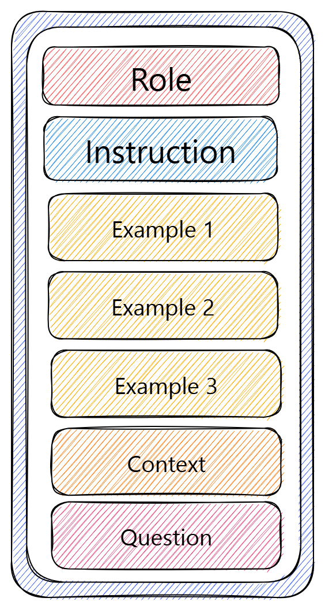
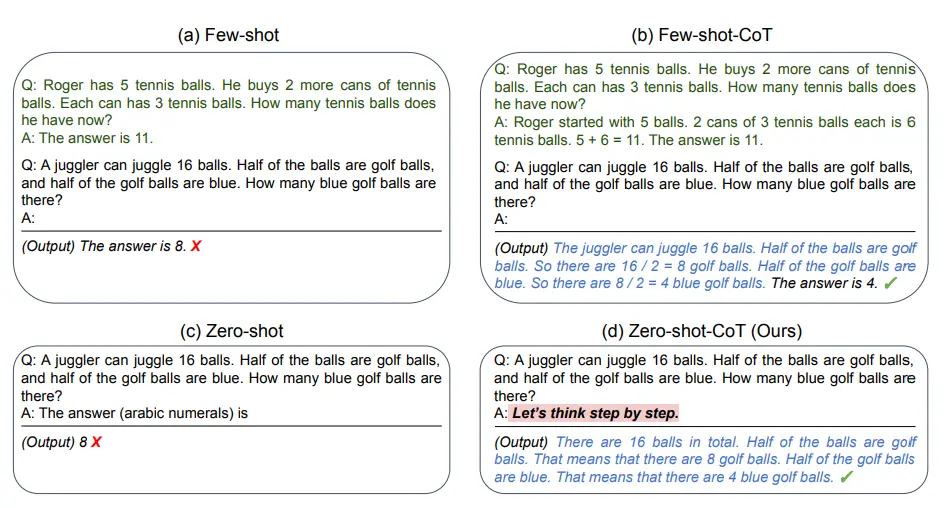

# Prompt Engineering

- [Prompt Engineering](#prompt-engineering)
  - [Question to answer before the training](#question-to-answer-before-the-training)
  - [Introduction](#introduction)
  - [Formating Prompts](#formating-prompts)
  - [Basic Structure of a Prompt](#basic-structure-of-a-prompt)
    - [Directive](#directive)
    - [Example](#example)
    - [Role (Persona)](#role-persona)
    - [Output Formatting](#output-formatting)
    - [Additional Information](#additional-information)
  - [Prompting Techniques](#prompting-techniques)
    - [Zero-Shot Prompting](#zero-shot-prompting)
    - [Few-Shot Prompting](#few-shot-prompting)
    - [Chain of Thought](#chain-of-thought)
      - [Zero-shot COT Prompting](#zero-shot-cot-prompting)
  - [Exercise](#exercise)

## Question to answer before the training

- What is the correct order of the elements in a prompt structure?
- How many examples should we add to the prompt?
- What is an effective prompt?

## Introduction

What is a prompt? Very simple: A prompt is an intruction you give an LLM to conduct a task or to present an output. A prompt can contain information like the instruction or question you are passing to the model and include other details such as context, inputs, or examples. A prompt can also very simple like "Tell me about volcano".

Let's get started by going over a basic example of a simple prompt:

Prompt

```text
The sky is
```

Output:

```text
blue.
```

Let's try to improve it a bit:

Prompt:

```text
Complete the sentence:
The sky is
```

Output:

```text
blue during the day and dark at night.
```

Is that better? Well, with the prompt above you are instructing the model to complete the sentence so the result looks a lot better as it follows exactly what you told it to do ("complete the sentence"). This approach of designing effective prompts to instruct the model to perform a desired task is what's referred to as **prompt engineering** in this guide.

## Formating Prompts

Prompts can be formatted into Q&A (Question and Answer) form. Which will look like:

```text
Q: <Question>?
A:
```

This structure is commonly used in "few-shot prompting" when examples are included.
Some of the benefits of this format are:

| Pro        | Description                                              |
| ---------- | -------------------------------------------------------- |
| Clarity    | Clearly separates instructions from input data.          |
| Accuracy   | Reduces hallucinations by constraining the output.       |
| Structure  | Provides consistent, predictable formatting.             |
| Efficiency | Enables in-context learning through examples (few-shot). |

## Basic Structure of a Prompt

A well-crafted prompt typically consists of:​

****

- **The Directive:** The main instruction or task.​
- **Examples:** Sample inputs/outputs to guide​ the expected response.​
- **Role (Persona):** The perspective or tone​ the AI should adopt.​
- **Output Formatting:** Specifications for​ how the response should be structured.​
- **Additional Information:** Background or context​ that informs the task.

### Directive

A directive is a concise instruction or question that gives the AI a clear task to perform. It can range from a request to generate text, solve a problem, or format information in a specific way.

For example, here a prompt with a single instruction:

```text
Tell me five good books to read.
```

**Implicit Directive**

In some cases, the directive may be implied rather than explicitly stated. These types of prompts still guide the AI but rely on context or formatting to convey the task.

An example if implicit directive:

```text
Night: Noche Morning:
```

**Best Practices for Directives:**

- Be clear and concise.
- Avoid ambiguous or vague instructions.
- When possible, use action verbs to indicate the specific task (e.g., "write," "list," "translate").

### Example

Examples demonstrate the expected format, style, or structure of the output. By including them in the prompt, you can guide the AI's behavior and help it better understand the desired result.
Giving prompts examples is also known as [few shots prompting ](#few-shot-prompting) technique.

```text
Translate the following sentences:
Q: I like apples. A: Me gustan las manzanas.
Q: I enjoy walking. A:
```

**Best Practices for Examples:**

- Provide clear and relevant examples that match the task.
- Use examples to demonstrate the structure or content you expect.
- Adjust the number of examples based on task complexity (one-shot or few-shot).

### Role (Persona)

Assigning a Role to the AI, also known as a persona, helps frame the response in a specific way. By telling the AI to act as an expert, a professional, or a specific character, you can guide the tone, style, and content of the response.

**What is a Role?**
The role element in a prompt assigns a specific persona or perspective to the AI, encouraging it to tailor its response according to the designated role. This can greatly enhance the accuracy and relevance of the response, especially for tasks requiring domain-specific knowledge or a particular tone.

Example:

```text
You are a doctor. Based on the following symptoms, diagnose the patient.
```

```text
You are a customer service agent. Write an email apologizing for a delayed order.
```

**Best Practices for Using Roles:**

- Use roles to add expertise or a specific perspective to the response.
- Ensure the role fits the task at hand (e.g., using a marketing expert to write promotional content).
- Combine the role with _additional context_ for better results.

### Output Formatting

Output Formatting ensures that the response follows a particular structure—whether it's a list, a table, or a paragraph. Specifying the format can help prevent misunderstandings and reduce the need for additional post-processing.

Example:

```text
Case: 2024_ABC_International Client: XYZ Corporation Jurisdiction: EU & USA Filed Date: 2024-09-01 Status: Active Lead Attorney: John Doe Next Hearing: 2024-10-15
Output this information as a CSV.
```

### Additional Information

Additional Information, sometimes referred to as _context_, though we discourage the use of this term as it is overloaded with other meanings in the prompting space ^-^. It provides the background details the AI needs to generate a relevant response.

Use Additional Information to add details/ information that LLM does not have to conduct the task specified in Directives. This element is especially important for complex tasks that require specific knowledge.

Example:

```text
January 1, 2000: Fractured right arm playing basketball. Treated with a cast.
February 15, 2010: Diagnosed with hypertension.
You are a doctor. Predict the patient's future health risks based on this history.
```

In this example, the patient's medical history is crucial to generating a valid prediction.

**Best Practices for Additional Information:**

- Include only relevant information—avoid overloading the prompt with unnecessary details.
- Ensure the information is clearly linked to the task.
- Use this element to provide essential background that the AI might not otherwise have.

## Prompting Techniques

### Zero-Shot Prompting

Zero-shot prompting means that the prompt used to interact with the model won't contain examples or demonstrations. The zero-shot prompt directly instructs the model to perform a task without any additional examples to steer it.

However, zero-shot technique should only be used for simple tasks when dealing with strong modern LLM.

Example:

```text
Prompt:
Classify the text into neutral, negative or positive.
Text: I think the vacation is okay.
Sentiment:
```

Output:

```text
Neutral
```

Note that in the prompt above we didn't provide the model with any examples of text alongside their classifications, the LLM already understands "sentiment" -- that's the zero-shot capabilities at work.

[Instruction tuning](https://arxiv.org/pdf/2109.01652) can be used to improve zero-shot prompts.

### Few-Shot Prompting

While large-language models demonstrate remarkable zero-shot capabilities, they still fall short on more complex tasks when using the zero-shot setting. Few-shot prompting can be used as a technique to enable in-context learning where we provide demonstrations in the prompt to steer the model to better performance.

Let's demonstrate few-shot prompting via an example that was presented in Brown et al. 2020. In the example, the task is to correctly use a new word in a sentence.

Prompt:

```text
A "whatpu" is a small, furry animal native to Tanzania. An example of a sentence that uses the word whatpu is:
We were traveling in Africa and we saw these very cute whatpus.

To do a "farduddle" means to jump up and down really fast. An example of a sentence that uses the word farduddle is:
```

Output:

```text
When we won the game, we all started to farduddle in celebration.
```

We can observe that the model has somehow learned how to perform the task by providing it with just one example (i.e., 1-shot). For more difficult tasks, we can experiment with increasing the demonstrations (e.g., 3-shot, 5-shot, 10-shot, etc.).

Following the findings from Min et al. (2022), here are a few more tips about demonstrations/exemplars when doing few-shot:

- "the label space and the distribution of the input text specified by the demonstrations are both important (regardless of whether the labels are correct for individual inputs)"
- the format you use also plays a key role in performance, even if you just use random labels, this is much better than no labels at all.
- additional results show that selecting random labels from a true distribution of labels (instead of a uniform distribution) also helps.

Let's try out a few examples. Let's first try an example with random labels (meaning the labels Negative and Positive are randomly assigned to the inputs):

Prompt:

```text
This is awesome! // Negative
This is bad! // Positive
Wow that movie was rad! // Positive
What a horrible show! //
```

Output:

```text
Negative
```

We still get the correct answer, even though the labels have been randomized. Note that we also kept the format, which helps too. In fact, with further experimentation, it seems the newer GPT models we are experimenting with are becoming more robust to even random formats. Example:

Prompt:

```text
Positive This is awesome!
This is bad! Negative
Wow that movie was rad!
Positive
What a horrible show! --
```

Output:

```text
Negative
```

There is no consistency in the format above but the model still predicted the correct label. We have to conduct a more thorough analysis to confirm if this holds for different and more complex tasks, including different variations of prompts.

**Limitations of Few-shot Prompting**

Standard few-shot prompting works well for many tasks but is still not a perfect technique, especially when dealing with more complex reasoning tasks. Let's demonstrate why this is the case. Do you recall the previous example where we provided the following task:

```text
The odd numbers in this group add up to an even number: 15, 32, 5, 13, 82, 7, 1.
A:
```

If we try this again, the model outputs the following:

```text
Yes, the odd numbers in this group add up to 107, which is an even number.
```

This is not the correct response, which not only highlights the limitations of these systems but that there is a need for more advanced prompt engineering.

Let's try to add some examples to see if few-shot prompting improves the results.

Prompt:

```text
The odd numbers in this group add up to an even number: 4, 8, 9, 15, 12, 2, 1.
A: The answer is False.
The odd numbers in this group add up to an even number: 17,  10, 19, 4, 8, 12, 24.
A: The answer is True.
The odd numbers in this group add up to an even number: 16,  11, 14, 4, 8, 13, 24.
A: The answer is True.
The odd numbers in this group add up to an even number: 17,  9, 10, 12, 13, 4, 2.
A: The answer is False.
The odd numbers in this group add up to an even number: 15, 32, 5, 13, 82, 7, 1.
A:
```

Output:

```text
The answer is True.
```

That didn't work. It seems like few-shot prompting is not enough to get reliable responses for this type of reasoning problem. The example above provides basic information on the task. If you take a closer look, the type of task we have introduced involves a few more reasoning steps. In other words, it might help if we break the problem down into steps and demonstrate that to the model. More recently, [chain-of-thought](#chain-of-thought) (CoT) prompting has been popularized to address more complex arithmetic, commonsense, and symbolic reasoning tasks.

### Chain of Thought

Introduced in [Wei et al. (2022)](https://arxiv.org/abs/2201.11903), chain-of-thought (CoT) prompting enables complex reasoning capabilities through intermediate reasoning steps. You can combine it with few-shot prompting to get better results on more complex tasks that require reasoning before responding.

Prompt:

```text
The odd numbers in this group add up to an even number: 4, 8, 9, 15, 12, 2, 1.
A: Adding all the odd numbers (9, 15, 1) gives 25. The answer is False.
The odd numbers in this group add up to an even number: 17,  10, 19, 4, 8, 12, 24.
A: Adding all the odd numbers (17, 19) gives 36. The answer is True.
The odd numbers in this group add up to an even number: 16,  11, 14, 4, 8, 13, 24.
A: Adding all the odd numbers (11, 13) gives 24. The answer is True.
The odd numbers in this group add up to an even number: 17,  9, 10, 12, 13, 4, 2.
A: Adding all the odd numbers (17, 9, 13) gives 39. The answer is False.
The odd numbers in this group add up to an even number: 15, 32, 5, 13, 82, 7, 1.
A:
```

Output:

```text
Adding all the odd numbers (15, 5, 13, 7, 1) gives 41. The answer is False.
```

This time we can see that the LLM finally got it right.

#### Zero-shot COT Prompting



One recent idea that came out more recently is the idea of zero-shot CoT (Kojima et al. 2022) that essentially involves adding "Let's think step by step" to the original prompt. Example:

```text:
I went to the market and bought 10 apples. I gave 2 apples to the neighbor and 2 to the repairman. I then went and bought 5 more apples and ate 1. How many apples did I remain with?
Let's think step by step.
```

Output:

```text
First, you started with 10 apples.
You gave away 2 apples to the neighbor and 2 to the repairman, so you had 6 apples left.
Then you bought 5 more apples, so now you had 11 apples.
Finally, you ate 1 apple, so you would remain with 10 apples.
```

This is useful for when you want the models to solve complex problems, but you do not have many examples.

## Exercise

Read this paper and discuss in class:

- [Automatic CoT](https://arxiv.org/abs/2210.03493)
- [Self-Consistency](https://arxiv.org/abs/2203.11171)
- [Meta Prompting for AI System](https://arxiv.org/abs/2311.11482)

---
